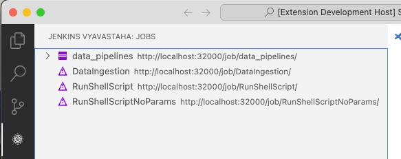
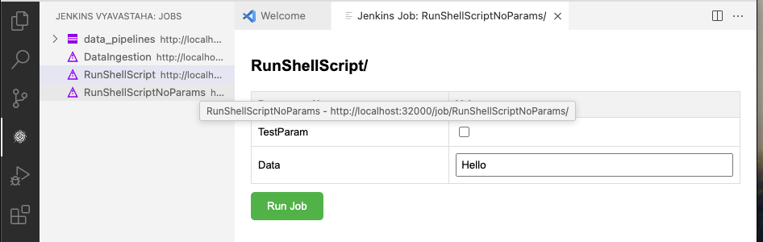
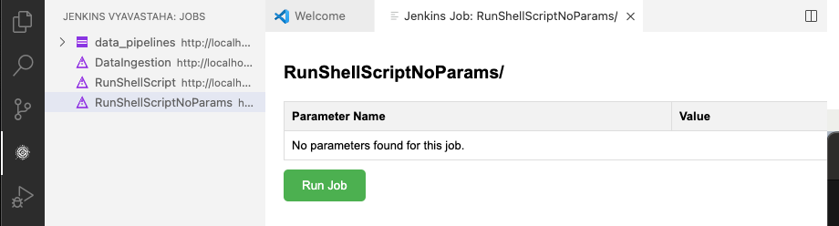
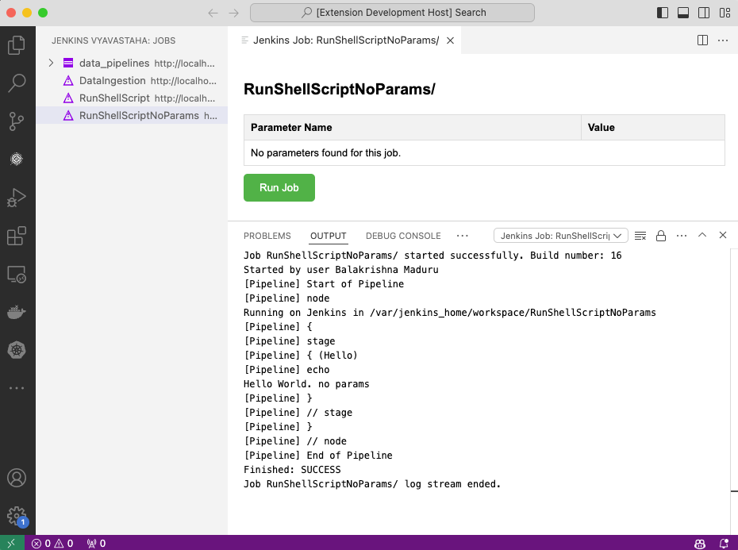
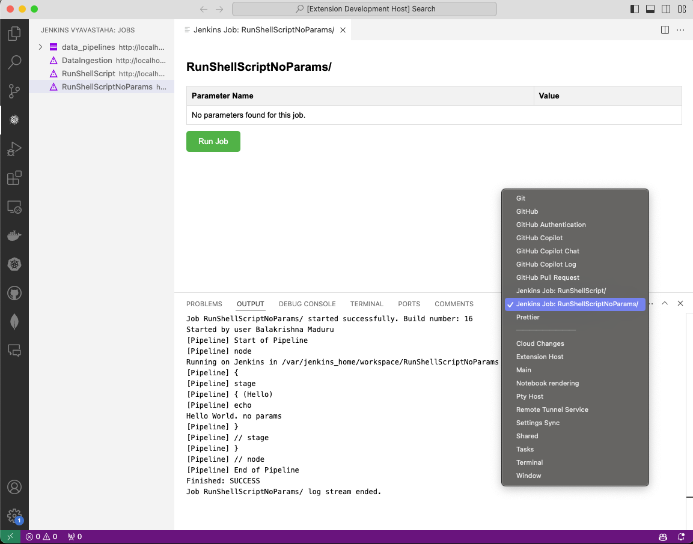

# Jenkins Vyavastaha


Run Jenkins pipeline scripts from within VS Code.

## Features

- List Jenkins jobs
- Open Jenkins jobs
- Trigger Jenkins jobs with or without parameters
- Refresh Jenkins jobs
- Stream logs of Jenkins jobs
- Automatic webview handling (open/close)
- Output channel for log streaming

## Installation

1. Install the extension from the VS Code marketplace.
2. Configure your Jenkins server URL and authentication in the extension settings.

## Configuration

1. You can configure the extension settings in two ways:\
    a. Using the VS Code settings UI. (`Ctrl+Shift+P` or `Cmd+Shift+P`) \
    b. Type `jenkinsJobs.configure` and select the command. \
    c. Enter the details as asked in the prompt.
    
2. Manually`jenkins.url`, `jenkins.username`, and `jenkins.password` settings in your VS Code `settings.json` file.

### Settings

- **Jenkins URL**: The base URL of your Jenkins server.
- **Jenkins Username**: The username for Jenkins authentication.
- **Jenkins Password**: The password or API token for Jenkins authentication.
- **Crumb Issuer**: Whether to use crumbIssuer for CSRF protection.
- **Reject Unauthorized**: Whether to reject unauthorized SSL certificates.
- **Job List File Path**: The path to the file where Jenkins jobs are stored. If not specified, a default path within the VS Code storage directory will be used.

### Example Configuration

```json
{
    "jenkins.url": "http://localhost:8080",
    "jenkins.username": "your-username",
    "jenkins.password": "your-api-token",
    "jenkins.crumbIssuer": true,
    "jenkins.rejectUnauthorized": true,
    "jenkins.jobListFilePath": "/path/to/your/job_list.json"
}
```

## Usage

### Listing Jenkins Jobs

1. Open the command palette (`Ctrl+Shift+P` or `Cmd+Shift+P`).
2. Type `List Jenkins Jobs` and select the command.
3. The list of Jenkins jobs will be displayed in the Explorer view under the "Jenkins Vyavastaha" section.



### Opening a Jenkins Job

1. Click on a job in the list to open its details.
2. A webview will be displayed with the job details and parameters (if any).
3. If a webview for the job is already open, it will be updated with the latest details. Otherwise, a new webview will be created.

### Triggering a Jenkins Job

#### With Parameters

1. When you open a job, the webview will display the job parameters.
2. Fill in the required parameters in the form.
3. Click the `Run Job` button to start the job with the specified parameters.
4. The webview will close immediately after clicking the `Run Job` button.
5. The output channel for the job will be shown automatically, and the logs will be streamed.

#### Job with parameters


#### Without Parameters

1. If the job has no parameters, the webview will indicate that no parameters are found.
2. Click the `Run Job` button to start the job without any parameters.
3. The webview will close immediately after clicking the `Run Job` button.
4. The output channel for the job will be shown automatically, and the logs will be streamed.

#### Job without parameters


### Refreshing Jenkins Jobs

1. Open the command palette (`Ctrl+Shift+P` or `Cmd+Shift+P`).
2. Type `Refresh Jenkins Jobs` and select the command.
3. The job list will be refreshed with the latest data from the Jenkins server.

### Log Streaming

- Logs for Jenkins jobs are streamed to an output channel within VS Code.
- The output channel is named after the Jenkins job (`Jenkins Job: <job-name>`).
- The latest triggered job's output channel is shown automatically after the job is started.
- To switch between output channels, use the Output view dropdown in VS Code.



### Changing Output Dropdown

1. Open the Output view by clicking on the Output tab in the bottom panel of VS Code.
2. Click on the dropdown at the top-right corner of the Output view.
3. Select the desired output channel from the list (e.g., `Jenkins Job: <job-name>`).



### Manually define jason file you can use below format

```json
[
  {
    "_class": "com.cloudbees.hudson.plugins.folder.Folder",
    "name": "data_pipelines",
    "url": "http://localhost:32000/job/data_pipelines/",
    "jobs": [
      {
        "_class": "org.jenkinsci.plugins.workflow.job.WorkflowJob",
        "name": "ShellRunner",
        "url": "http://localhost:32000/job/data_pipelines/job/ShellRunner/"
      }
    ]
  },
  {
    "_class": "hudson.model.FreeStyleProject",
    "name": "DataIngestion",
    "url": "http://localhost:32000/job/DataIngestion/"
  },
  {
    "_class": "org.jenkinsci.plugins.workflow.job.WorkflowJob",
    "name": "RunShellScript",
    "url": "http://localhost:32000/job/RunShellScript/"
  },
  {
    "_class": "org.jenkinsci.plugins.workflow.job.WorkflowJob",
    "name": "RunShellScriptNoParams",
    "url": "http://localhost:32000/job/RunShellScriptNoParams/"
  }
]
``` 

## Contributing

Contributions are welcome! Please submit a pull request or open an issue on [GitHub](https://github.com/balakrishna-maduru/jenkins-vyavastaha.git).

### Development Setup

1. Clone the repository.
2. Run `npm install` to install dependencies.
3. Open the project in VS Code.
4. Run the `npm run compile` command to compile the TypeScript code.
5. Press `F5` to start debugging the extension.

## License

SEE LICENSE IN LICENSE
